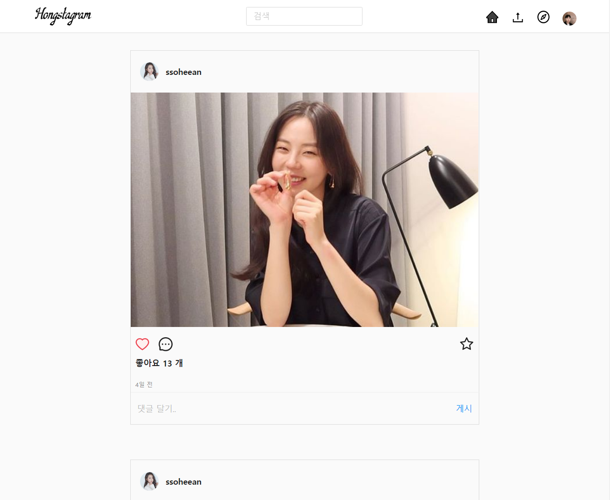
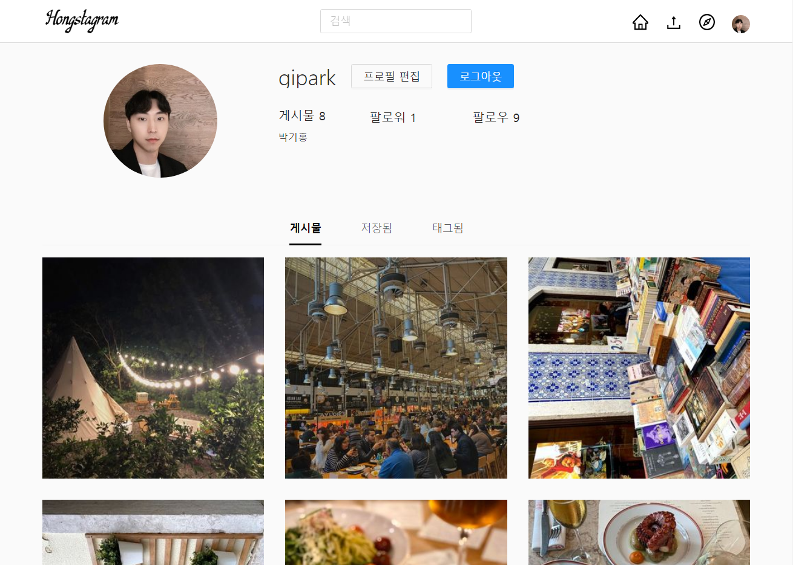
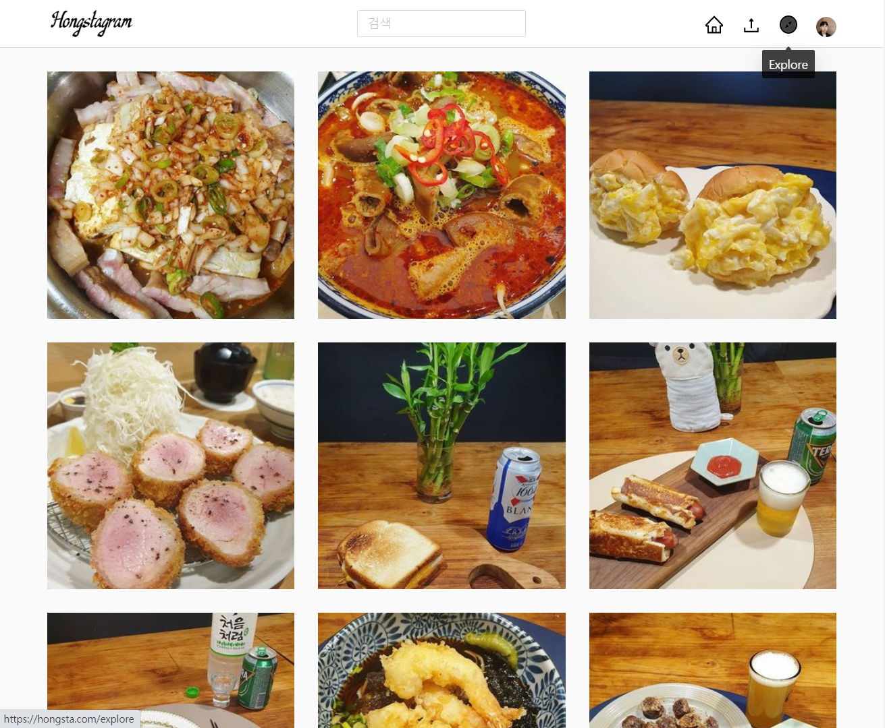
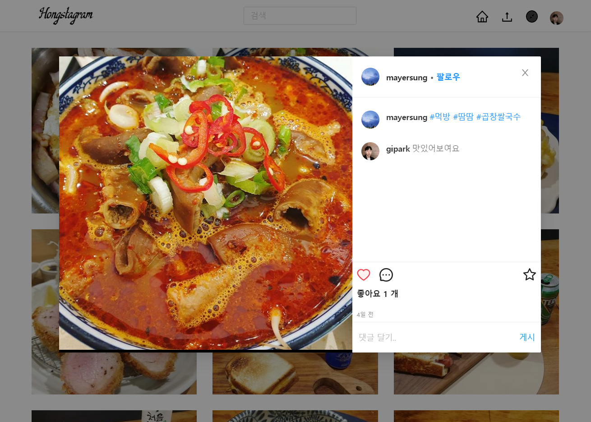
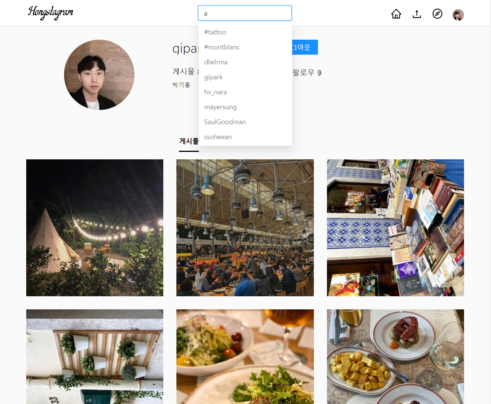

# Hongstagram

### 소개

- 사용자 간 사진 공유 소셜 네트워킹 서비스
- [https://hongsta.com](https://hongsta.com)

### 기술 스택

- Front-End : Javascript, React, Redux-Saga, Next.js, Ant-Design
- Back-End : Express, Mysql, Sequelize
- ETC : AWS, Github

### 기능

- 홈

    

    - 사용자와 사용자가 팔로우한 유저의 피드를 확인할 수 있습니다.
- 프로필

    

    - 사용자 정보 확인 및 편집할 수 있습니다.
    - 게시물 - 사용자가 업로드한 피드를 확인할 수 있습니다.
    - 저장됨 - 사용자가 저장해 놓은 피드를 확인할 수 있습니다.
    - 태그됨 - 사용자가 태그된 피드를 확인할 수 있습니다.
- 탐색

    

    - 사용자와 사용자가 팔로우한 유저를 제외한 다양한 유저의 피드를 확인할 수 있습니다.
- 게시물 상세 화면

    

    - 게시물 상세 정보를 확인할 수 있습니다.
    - 댓글을 통해 사용자 간 소통을 할 수 있습니다.
- 검색

    

    - 사용자 또는 해시태그를 검색할 수 있습니다.
    - @사용자 이름 - 사용자 검색
    - #해시태그 - 해시태그 검색